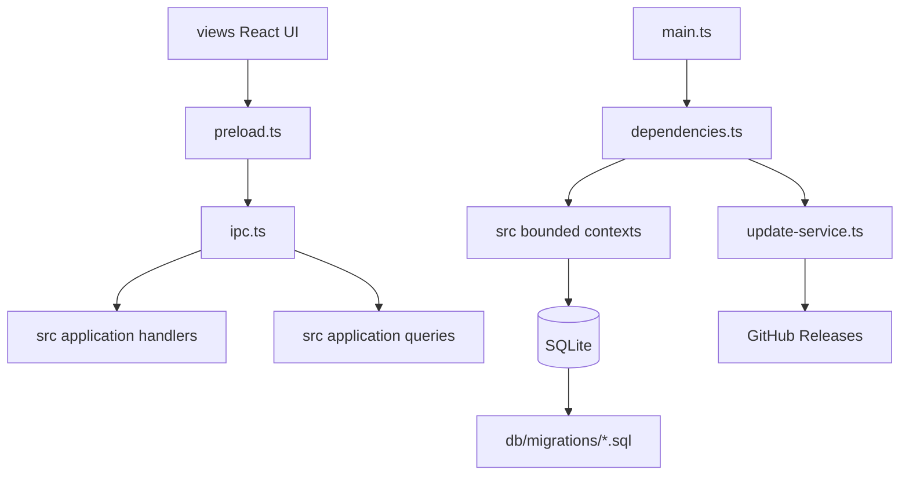

# Desktop Distribution And Architecture Design

**Spec**: `.agents/specs/features/desktop-distribution-and-architecture/spec.md`
**Status**: Verified

---

## Architecture Overview

This change keeps the hexagonal business contexts under `src/` and moves Electron/React framework infrastructure to root-level entry points and `views/`.

```text
.
├── main.ts
├── preload.ts
├── dependencies.ts
├── ipc.ts
├── sync-scheduler.ts
├── update-service.ts
├── electron-secret-codec.ts
├── db/
│   └── migrations/
│       ├── V1__initial_schema.sql
│       └── V2__remembered_sessions.sql
├── views/
│   ├── index.html
│   └── src/
│       ├── app.tsx
│       ├── main.tsx
│       ├── components/
│       ├── lib/
│       └── styles/
└── src/
    ├── fiscal-entity/
    ├── settings/
    ├── tax-document/
    └── shared/
        ├── auth/
        ├── session/
        ├── sqlite/
        └── ...
```

The root Electron files are infrastructure. They may import from `src/` and `views` contracts, but business contexts never import root Electron files or view code.



## Code Reuse Analysis

### Existing Components To Keep

| Component | Current Location | Target Location | Notes |
| --- | --- | --- | --- |
| Bounded contexts | `src/fiscal-entity`, `src/settings`, `src/tax-document` | Same | Keep domain/application/outbound structure. |
| Shared building blocks | `src/shared` | Same | Extend with SQL migration runner and remembered session support. |
| Electron dependencies root | `src/main/dependencies.ts` | `dependencies.ts` | Root infrastructure composition file. |
| Electron IPC | `src/main/ipc.ts` | `ipc.ts` | Still the inbound transport adapter. |
| Preload API | `src/preload/index.ts` | `preload.ts` | Keep context isolation contract. |
| React UI | `src/renderer` | `views/` | UI no longer lives under business source. |

### New Components

| Component | Location | Purpose |
| --- | --- | --- |
| SQL migration files | `db/migrations` | Reviewable schema evolution. |
| Migration runner | `src/shared/sqlite/migration-runner.ts` | Loads files, validates checksums, baselines legacy DBs and runs pending SQL. |
| Remembered session store | `src/shared/session/remembered-session-store.ts` | Persists and resumes opt-in sessions. |
| Update service | `update-service.ts` | Wraps `electron-updater` and exposes status/events to IPC. |
| Build config | `electron-builder.yml` or `package.json > build` | Defines app id, targets, artifact names and GitHub publish provider. |
| CI workflow | `.github/workflows/ci.yml` | PR quality gate. |
| Release workflow | `.github/workflows/release.yml` | Cross-platform package and publish workflow. |

## Distribution Design

### Packaging Tool

Use `electron-builder` with `electron-updater`.

Package targets:

| OS | Runner | Targets | Auto-update metadata |
| --- | --- | --- | --- |
| Windows | `windows-latest` | `nsis` | `latest.yml` |
| macOS | `macos-latest` | `dmg`, `zip` | `latest-mac.yml` |
| Linux | `ubuntu-latest` | `AppImage`, optional `deb` | `latest-linux.yml` |

The GitHub provider is configured once and release jobs set `GH_TOKEN` from `${{ secrets.GITHUB_TOKEN }}`.

### Version Policy

- Release tags use `vX.Y.Z`.
- `package.json.version` must equal `X.Y.Z`.
- Release workflow validates tag and package version before building.
- Build artifact names include `${name}-${version}-${os}-${arch}` where possible.

### Signing And Notarization

| Platform | Minimum For CI Artifact | Production Requirement |
| --- | --- | --- |
| Windows | Unsigned NSIS can be built | Code signing certificate recommended. |
| macOS | Unsigned DMG/ZIP can be built for internal testing | Signed and notarized app required for smooth production updates. |
| Linux | AppImage can be built unsigned | Optional GPG/signature policy later. |

The release workflow should support signing secrets, but fail clearly or mark unsigned artifacts when secrets are absent. macOS automatic update in production must be treated as blocked until signing/notarization credentials are configured.

## GitHub Actions Design

### Pull Request CI

Workflow: `.github/workflows/ci.yml`

Triggers:

- `pull_request` with `branches: [main, master]`
- Optional `push` to `main` or `master` for post-merge confidence

Jobs:

1. Checkout.
2. Setup Node.
3. `npm ci`.
4. `npm run lint`.
5. `npm run typecheck`.
6. `npm test`.
7. `npm run build`.

### Release Build

Workflow: `.github/workflows/release.yml`

Trigger:

- `release` with `types: [published]`

Matrix:

- `ubuntu-latest`
- `macos-latest`
- `windows-latest`

Steps:

1. Checkout the release ref/tag.
2. Setup Node.
3. Validate `vX.Y.Z` tag matches `package.json.version`.
4. `npm ci`.
5. `npm run lint`.
6. `npm run typecheck`.
7. `npm test`.
8. `npm run dist -- --publish always`.

The release job should upload artifacts to the GitHub Release created by the UI, not create a separate release.

## Auto Update Design

`update-service.ts` owns framework-specific update behavior and is wired by `main.ts`.

Runtime behavior:

1. In packaged app, configure updater logger and GitHub provider from build metadata.
2. On app ready, check for updates after the main window is created.
3. Expose IPC methods:
   - `updates:status`
   - `updates:check`
   - `updates:install`
4. Emit renderer events for:
   - checking
   - available
   - not-available
   - downloading
   - downloaded
   - error
5. In development, return `disabled` status and do not call the remote feed.

UI:

- Configurações shows current version.
- Configurações has "Verificar atualizações".
- When update is downloaded, show a banner/action to restart and install.

## Remembered Login Design

### Session Types

| Session Type | Storage | Lifetime |
| --- | --- | --- |
| In-memory session | Process memory | Until logout or app quit. |
| Remembered session | Encrypted local token + hashed DB record | Until logout, invalidation or integrity failure. |

The app never stores the password.

### Persistence Model

Add a table through SQL migration:

```sql
CREATE TABLE remembered_sessions (
  id TEXT PRIMARY KEY,
  user_id TEXT NOT NULL,
  token_hash TEXT NOT NULL UNIQUE,
  created_at TEXT NOT NULL,
  last_used_at TEXT NOT NULL,
  FOREIGN KEY (user_id) REFERENCES users(id) ON DELETE CASCADE
);
```

Store the raw remembered token encrypted with the existing `SecretCodec` abstraction in an app-data session file, or another shared adapter with equivalent encrypted local storage. Store only the token hash in SQLite.

### Auth Flow

1. `auth:state` reports whether an admin exists and whether a remembered session can resume.
2. App startup asks `auth:resume`.
3. If resume succeeds, the main process starts an in-memory session and starts the sync loop.
4. Login accepts `{ username, password, remember }`.
5. Logout clears the in-memory session and remembered session.

`src/auth` can be collapsed into `src/shared/auth` if auth is treated as app security infrastructure rather than a business bounded context. Either way, fiscal business contexts must not import auth/session internals.

## Migration Design

### File Naming

Use Flyway-style files:

```text
db/migrations/V1__initial_schema.sql
db/migrations/V2__remembered_sessions.sql
```

Parser:

- `V`
- integer version
- `__`
- kebab/snake description
- `.sql`

### Migration History

Use a Flyway-compatible table shape:

```sql
CREATE TABLE IF NOT EXISTS flyway_schema_history (
  installed_rank INTEGER PRIMARY KEY,
  version TEXT NOT NULL UNIQUE,
  description TEXT NOT NULL,
  type TEXT NOT NULL,
  script TEXT NOT NULL,
  checksum TEXT NOT NULL,
  installed_by TEXT NOT NULL,
  installed_on TEXT NOT NULL DEFAULT CURRENT_TIMESTAMP,
  execution_time INTEGER NOT NULL,
  success INTEGER NOT NULL
);
```

### Legacy Baseline

Existing databases may have tables created by the current inline `Migrations` class and `schema_migrations`.

Baseline rules:

1. If `flyway_schema_history` is empty and core tables already exist, mark `V1__initial_schema.sql` as applied after validating the schema has the expected baseline tables.
2. Then run pending SQL migrations such as `V2__remembered_sessions.sql`.
3. Do not encode conditional schema logic inside migration files; migrations stay plain SQL.

## Source Layout Design

### Root Infrastructure

Move these files:

| From | To |
| --- | --- |
| `src/main/index.ts` | `main.ts` |
| `src/main/dependencies.ts` | `dependencies.ts` |
| `src/main/ipc.ts` | `ipc.ts` |
| `src/main/sync-scheduler.ts` | `sync-scheduler.ts` |
| `src/main/electron-secret-codec.ts` | `electron-secret-codec.ts` |
| `src/preload/index.ts` | `preload.ts` |
| `src/renderer` | `views` |

### Aliases

| Alias | Target | Use |
| --- | --- | --- |
| `@/` | `src/` | Business contexts and shared support. |
| `@views/` | `views/src/` | React renderer code. |
| `@main/` | project root or `main/` infra folder if introduced | Electron infrastructure imports only. |

`electron.vite.config.ts` must point main/preload/renderer builds to the new entries.

## Error Handling Strategy

| Error Scenario | Handling | User Impact |
| --- | --- | --- |
| Release version mismatch | Fail release workflow before package. | Maintainer fixes tag or package version. |
| Missing signing secret | Clear CI message or unsigned internal artifact label. | Maintainer sees distribution limitation. |
| Update check offline | Non-fatal update status error. | App remains usable. |
| Remembered token decryption fails | Delete remembered token and require login. | User logs in again. |
| Migration checksum mismatch | Fail startup with clear integrity error. | Maintainer investigates migration drift. |
| Legacy database baseline mismatch | Fail startup before destructive changes. | User data is preserved. |

## Tech Decisions

| Decision | Choice | Rationale |
| --- | --- | --- |
| Packaging | `electron-builder` | Common Electron packaging path with GitHub publish support and updater metadata generation. |
| Updates | `electron-updater` | Integrates with `electron-builder` metadata and GitHub Releases. |
| Linux update target | AppImage | Best-supported Linux target for desktop auto-update metadata in this setup. |
| Migration names | `V<version>__<description>.sql` | Matches Flyway versioned migration convention requested by the user. |
| Session token storage | Encrypted local token + hashed DB token | Avoids storing passwords or raw persistent tokens in SQLite. |
| UI location | `views/` | Keeps `src/` focused on bounded contexts/shared code. |

## References

- Electron Builder auto update documentation: `https://www.electron.build/auto-update`
- Electron Builder publish configuration: `https://www.electron.build/publish`
- GitHub Actions release event documentation: `https://docs.github.com/actions/using-workflows/events-that-trigger-workflows#release`
- GitHub Actions workflow syntax: `https://docs.github.com/actions/using-workflows/workflow-syntax-for-github-actions`
