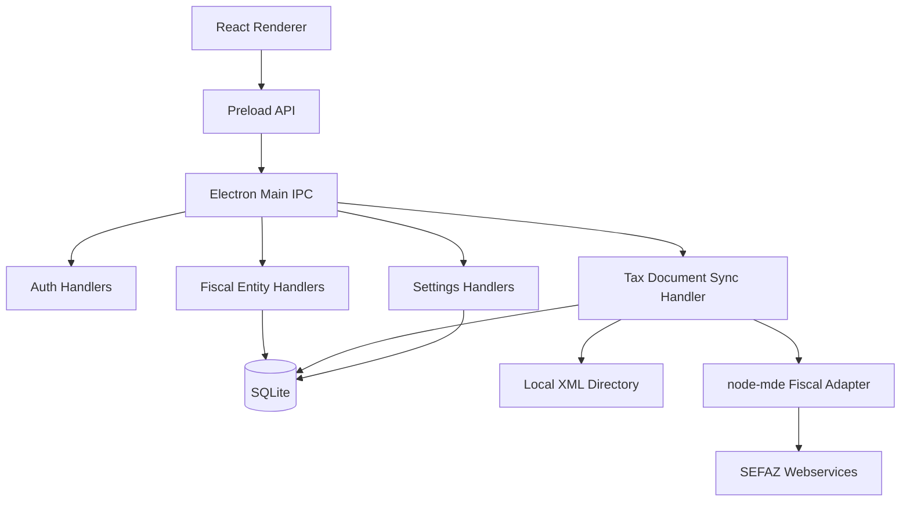

# Desktop Tax Document Sync Design

**Spec**: `.agents/specs/features/desktop-tax-document-sync/spec.md`
**Status**: Verified

---

## Architecture Overview

The app is an Electron desktop application with a React renderer. The main process is the composition root and the only place that wires inbound IPC handlers to application handlers and outbound adapters. Domain and application code live under bounded contexts in `src/`.



## Code Reuse Analysis

### Existing Components to Leverage

| Component | Location | How to Use |
| --- | --- | --- |
| Legacy DFe downloader | `~/dev/erp/src/DFe/Service/DFeDownloader.php` | Behavioral reference for status codes, NSU handling and manifestation/download flow. |
| Legacy company model | `~/dev/erp/src/DFe/Model/Company/Company.php` | Reference for last NSU and next search scheduling. |
| Legacy tax document model | `~/dev/erp/src/DFe/Model/TaxDocument/TaxDocument.php` | Reference for statuses and stored content. |
| Low-level design skill | `~/.harness/skills/low-level-design` | Directory and dependency structure for ports/adapters/CQS. |

### Integration Points

| System | Integration Method |
| --- | --- |
| SQLite | `better-sqlite3` adapter behind repository ports. |
| SEFAZ NF-e services | `node-mde` adapter behind `FiscalDocumentGateway`. |
| Local filesystem | `DocumentStorage` adapter writes XML files under configured directory. |
| Electron | IPC inbound in main process, context-isolated preload API for renderer. |

## Components

### Auth Context

- **Purpose**: First-run setup, password hashing, login/logout and session guard.
- **Location**: `src/auth/`
- **Interfaces**:
  - `SetupAdminHandler.handle(command): Promise<void>`
  - `LoginHandler.handle(command): Promise<{ token: string }>`
  - `AuthRepository` for local user persistence.
- **Dependencies**: SQLite adapter, Node crypto.

### Fiscal Entity Context

- **Purpose**: Manage companies and their A1 certificates.
- **Location**: `src/fiscal-entity/`
- **Interfaces**:
  - `SaveFiscalEntityHandler.handle(command): Promise<{ fiscalEntityId: string }>`
  - `FiscalEntities.of(id)`, `eligibleForSynchronization(now)`, `save(entity)`.
- **Dependencies**: SQLite adapter, secret codec for certificate fields.

### Tax Document Context

- **Purpose**: Synchronize and query tax documents.
- **Location**: `src/tax-document/`
- **Interfaces**:
  - `SynchronizeTaxDocumentsHandler.handle(command): Promise<SyncSummary>`
  - `TaxDocuments.byKey(key)`, `save(document)`
  - `FiscalDocumentGateway.search/manifest/download`
  - `DocumentStorage.saveXml`
- **Dependencies**: Fiscal entity repository port, tax document repository, fiscal service adapter, storage adapter.

### Settings Context

- **Purpose**: Persist document storage directory and sync interval.
- **Location**: `src/settings/`
- **Interfaces**:
  - `SaveSettingsHandler.handle(command): Promise<void>`
  - `SettingsQuery.execute(): Promise<AppSettingsRecord>`
- **Dependencies**: SQLite adapter.

### Renderer UI

- **Purpose**: Functional screens for login/setup, companies, documents, settings and sync status.
- **Location**: `src/renderer/`
- **Interfaces**: `window.taxDocumentSync` preload API.
- **Dependencies**: React, CSS, lucide icons.

## Data Models

### FiscalEntity

```typescript
interface FiscalEntityRecord {
  id: string;
  legalName: string;
  cnpj: string;
  uf: string;
  certificateContentBase64: string | null;
  certificatePassword: string | null;
  lastDfeSequenceNumber: number;
  nextSearchAt: string | null;
  createdAt: string;
  updatedAt: string;
}
```

### TaxDocument

```typescript
interface TaxDocumentRecord {
  id: string;
  fiscalEntityId: string;
  companyName: string;
  companyDocument: string;
  key: string;
  type: "INVOICE";
  status: "MANIFESTED" | "DOWNLOADED" | "LOADED";
  content: string | null;
  filePath: string | null;
  createdAt: string;
  updatedAt: string;
}
```

### App Settings

```typescript
interface AppSettingsRecord {
  storageDirectory: string;
  syncIntervalMinutes: number;
}
```

## Error Handling Strategy

| Error Scenario | Handling | User Impact |
| --- | --- | --- |
| Invalid login | Return `Invalid credentials`. | Login form stays visible. |
| Missing certificate field | Domain validation error. | Company form shows error. |
| SEFAZ cStat 656/137 | Schedule retry for 70 minutes. | Sync status reports delayed entity. |
| SEFAZ unexpected cStat | Log entity/key context and continue other entities. | Sync status shows error count. |
| Directory missing | Create recursively. | No user action required. |

## Tech Decisions

| Decision | Choice | Rationale |
| --- | --- | --- |
| Fiscal library | `node-mde` | Covers the legacy routine directly and avoids the Java SDK install requirement encountered with `nfewizard-io`. |
| Local DB | SQLite | Required by user; simple local app persistence. |
| Secrets | Electron `safeStorage` when available, base64 fallback in non-Electron tests/dev. | Keeps certificate handling behind adapter without blocking tests. |
| Status after XML save | `LOADED` | Legacy marked documents loaded after ERP import; in the standalone app the equivalent final local operation is persisted XML storage. |
